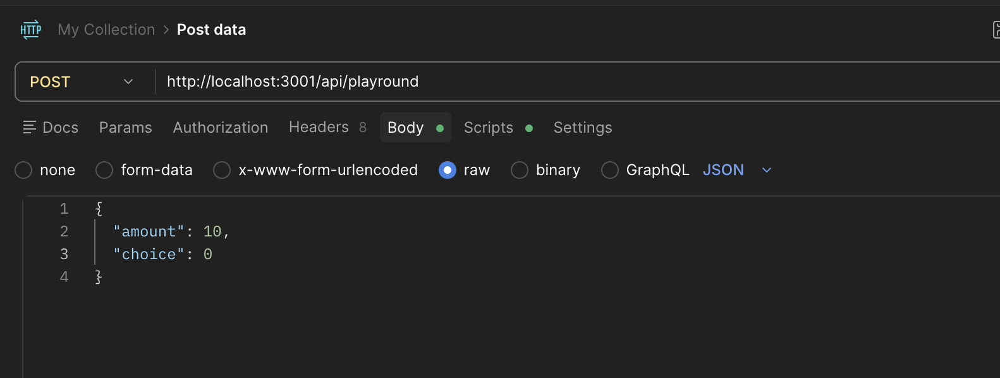
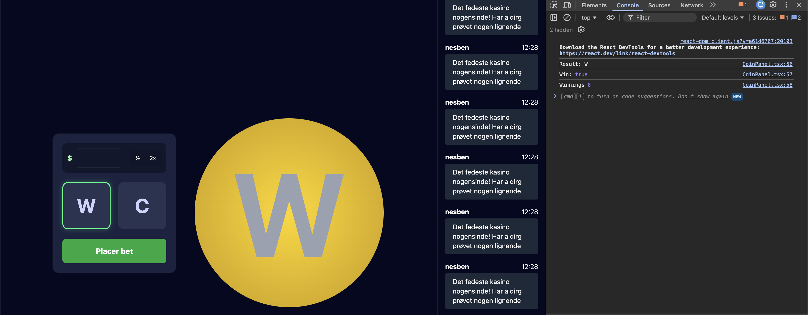

To test and rund coinflip frontend:

- one terminal npm run dev
- another terminal node server.js

Then it is possible to try the frontend, and test what is parsed to the ''mock'' backend, using F12 and the seeing in the web-console. it is also possible using postman:

and the frontend:
